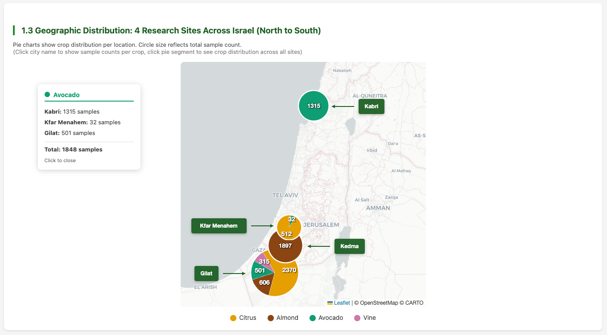
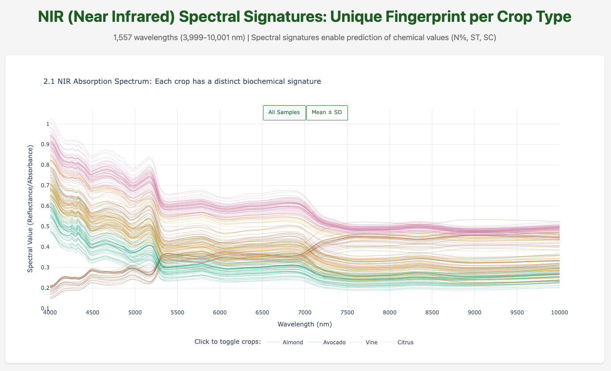
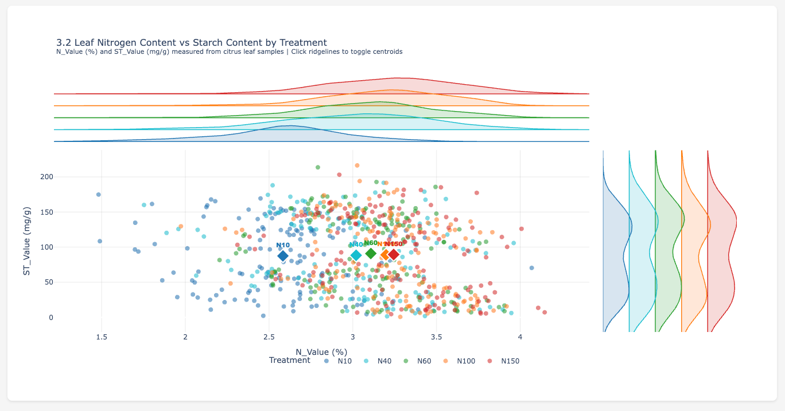
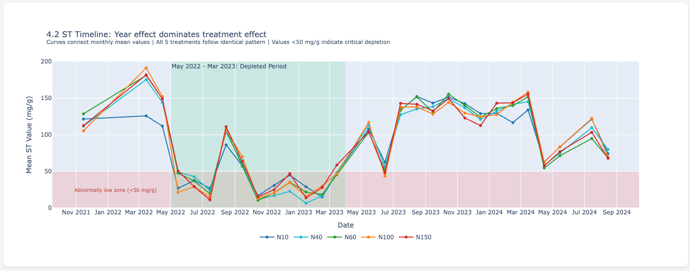
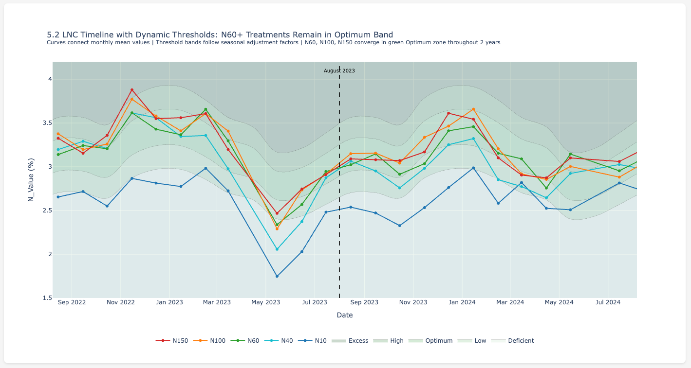
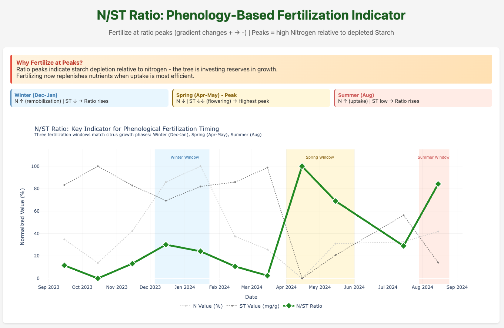

# Crop Analysis - Visualization Final Project

An interactive data visualization project exploring nitrogen status in agricultural crops using spectroscopy data. This project presents research findings from a Master's thesis through 6 connected HTML visualizations that tell a cohesive scientific story.

## The Story

This visualization project follows a research journey from data collection to a key discovery:

**The N/ST ratio (Nitrogen to Starch) outperforms Nitrogen alone for fertilization timing decisions.**

The visualizations progressively build this narrative:

1. **Data Collection** - Understanding the scope and geographic distribution of our dataset
2. **Spectral Exploration** - Examining the spectral signatures that enable non-destructive analysis
3. **NPK Experiment** - A controlled fertilization study with 5 nitrogen treatment levels
4. **ST Variance Discovery** - Uncovering that year/climate effects dominate over treatment effects
5. **LNC Classification** - Standard nitrogen status assessment using UC Davis thresholds
6. **N/ST Ratio Analysis** - The key insight - combining N and ST provides better fertilization timing

## Project Structure

```
Crop Analysis - Viausalization Final Project/
├── README.md                           # This file
├── docs/                               # Project documentation
│   ├── crop_analysis_visualization_report.pdf   # Full report (Hebrew)
│   └── crop_analysis_visualization_report.docx  # Editable version
├── data/                               # Datasets
│   ├── unified_dataset.parquet        # Main crop dataset
│   ├── npk_5_treatments_samples.csv   # NPK experiment data
│   ├── spectral_data.csv              # Full spectral measurements
│   └── israel_locations.json          # Geographic coordinates
├── shared/                             # Shared configuration
│   └── config.py                       # Colors, styling, constants
├── visualization_1_data_collection/    # Viz 1: Data Collection Story
│   ├── generate_data_collection_story.py
│   ├── data_collection_story.html
│   └── snapshots/                      # Screenshots
├── visualization_2_spectral_explorer/  # Viz 2: Spectral Data Explorer
│   ├── generate_spectral_explorer.py
│   ├── spectral_explorer.html
│   └── snapshots/
├── visualization_3_npk_experiment/     # Viz 3: NPK Experiment Analysis
│   ├── generate_npk_experiment.py
│   ├── npk_experiment.html
│   └── snapshots/
├── visualization_4_st_variance/        # Viz 4: ST Variance Analysis
│   ├── generate_st_variance_analysis.py
│   ├── st_variance_analysis.html
│   └── snapshots/
├── visualization_5_lnc_classification/ # Viz 5: LNC Status Classification
│   ├── generate_lnc_classification.py
│   ├── lnc_classification.html
│   └── snapshots/
└── visualization_6_nst_ratio_analysis/ # Viz 6: N/ST Ratio Analysis
    ├── generate_nst_ratio_analysis.py
    ├── nst_ratio_analysis.html
    └── snapshots/
```

## Quick Start

### Prerequisites

```bash
pip install pandas numpy plotly pyarrow
```

### Generate All Visualizations

```bash
# From the project root directory
cd "Crop Analysis - Viausalization Final Project"

# Generate each visualization
python visualization_1_data_collection/generate_data_collection_story.py
python visualization_2_spectral_explorer/generate_spectral_explorer.py
python visualization_3_npk_experiment/generate_npk_experiment.py
python visualization_4_st_variance/generate_st_variance_analysis.py
python visualization_5_lnc_classification/generate_lnc_classification.py
python visualization_6_nst_ratio_analysis/generate_nst_ratio_analysis.py
```

### View the Visualizations

Open the generated HTML files in any web browser:
- `visualization_1_data_collection/data_collection_story.html`
- `visualization_2_spectral_explorer/spectral_explorer.html`
- `visualization_3_npk_experiment/npk_experiment.html`
- `visualization_4_st_variance/st_variance_analysis.html`
- `visualization_5_lnc_classification/lnc_classification.html`
- `visualization_6_nst_ratio_analysis/nst_ratio_analysis.html`

## Documentation

A comprehensive project report is available in the `docs/` folder:
- **PDF Report**: `docs/crop_analysis_visualization_report.pdf` - Full documentation in Hebrew
- **Word Document**: `docs/crop_analysis_visualization_report.docx` - Editable version

Each visualization folder also contains a `snapshots/` subfolder with screenshots of all charts.

## Visualization Details

### 1. Data Collection Story
- **Timeline** of sample collection across years
- **Seasonal distribution** showing monthly coverage
- **Israel map** with sample locations (Gilat, Kedma, Kabri, Kfar Menahem)
- Interactive Plotly charts with hover information

### 2. Spectral Data Explorer
- **Toggle view** between mean spectrum and all individual samples
- **Interactive legend** to filter by crop type
- Wavelength range: 3,999 - 10,001 nm (near-infrared)
- 1,557 spectral measurements per sample

### 3. NPK Experiment Analysis
- **Treatment table** with 5 nitrogen levels (N10, N40, N60, N100, N150)
- **Scatter plots** showing N vs ST relationship
- **Box plots** comparing distributions across treatments
- Focus on the controlled experiment at Gilat Research Station

### 4. ST Variance Analysis
- **Monthly variance** box plots revealing unexplained variation
- **Timeline** showing all treatments follow the same ST pattern
- **Year-by-year comparison** confirming the year effect
- Discovery: 2022 was a "starch-depleted" year

### 5. LNC Status Classification
- **UC Davis thresholds** table with color coding
- **Seasonal adjustment factors** for accurate classification
- **Timeline visualization** with threshold bands
- Color scheme: Blue = Low, Teal = Optimum, Red = Excess

### 6. N/ST Ratio Analysis
- **Normalized comparison** (0-100%) for timing analysis
- **Full period view** (Aug 2022 - Aug 2024)
- **Recent period view** (excluding 2022 anomaly)
- Key insight: Ratio rises when ST drops = true fertilization signal

## Screenshots Preview

### 1. Data Collection - Israel Map


### 2. Spectral Explorer - All Samples View


### 3. NPK Experiment - Scatter & Ridgeline


### 4. ST Variance - Timeline by Treatment


### 5. LNC Classification - Timeline with Thresholds


### 6. N/ST Ratio - Normalized Comparison


## Scientific Background

### The Data
- **Crops**: Citrus, Almond, Avocado, Vine
- **Locations**: 4 research stations across Israel
- **Measurements**:
  - N_Value: Nitrogen content (%)
  - SC_Value: Soluble Carbohydrates (mg/g)
  - ST_Value: Starch content (mg/g)
  - Spectral data: 1,557 wavelengths

### The NPK Experiment
A controlled study at Gilat Research Station with 5 nitrogen fertilization levels:
| Treatment | N Rate (kg/ha) | Description |
|-----------|----------------|-------------|
| N10 | 10 | Very Low |
| N40 | 40 | Low |
| N60 | 60 | Optimal |
| N100 | 100 | Excessive |
| N150 | 150 | Very Excessive |

### Key Findings
1. **Year dominates ST variance** - Environmental factors affect all treatments equally
2. **LNC peaks in winter** - A concentration effect, not a fertilization signal
3. **N/ST ratio is superior** - Combines nitrogen status with metabolic context
4. **Optimal fertilization window** - Spring/summer, when the ratio rises

## Design Principles

- **Consistent green theme** - Agricultural context with forest green accents
- **Interactive Plotly charts** - Hover, zoom, pan, and export capabilities
- **Scientific tone** - Written for data scientists with agronomic background
- **Progressive narrative** - Each visualization builds on the previous

## Technology Stack

- **Python 3.9+**
- **Plotly** - Interactive visualizations
- **Pandas** - Data manipulation
- **NumPy** - Numerical computations
- **PyArrow** - Parquet file support

## License

This project is part of an academic visualization course and Master's thesis research.

## Author
Guy Mizrahi - 
Data Science Visualization Course Project
Master's Degree - Agricultural Spectroscopy Research
